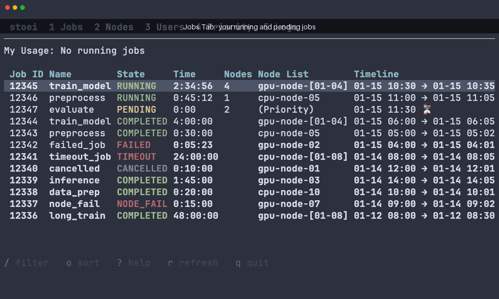
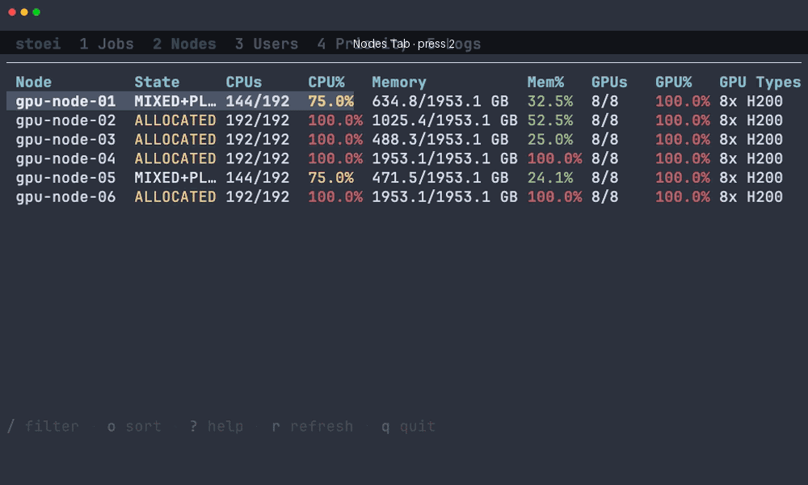
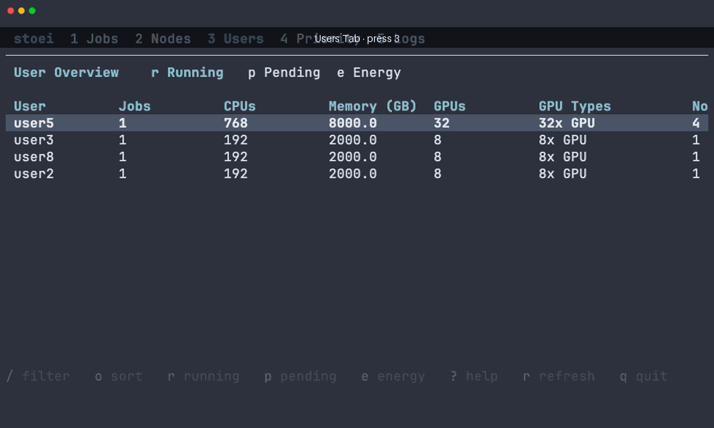
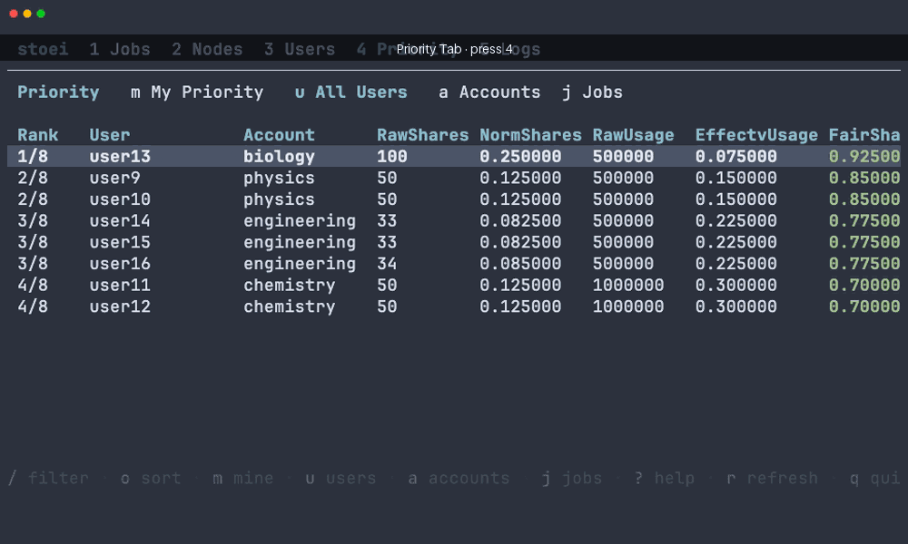
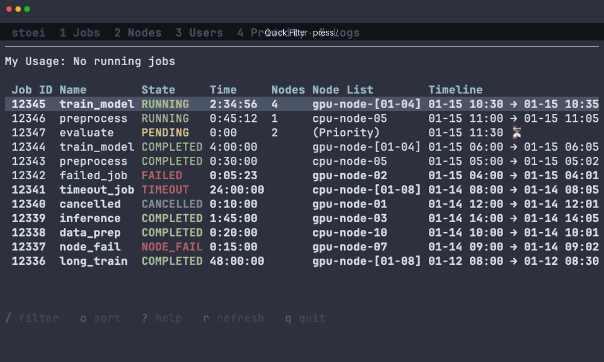

# Stoei

A terminal UI for monitoring Slurm jobs. It auto-refreshes, summarizes jobs, nodes, users, and cluster load, and lets you inspect, filter, and cancel jobs without leaving the terminal.

[](https://github.com/pjhartout/stoei/releases)
[](https://go.dev/)
[](https://github.com/pjhartout/stoei/blob/main/LICENSE)

### Jobs



### Nodes



### Users



### Priority



### Filtering



## Features

- Auto-refreshing job list with running/pending/requeue stats
- Completed-job history merged into the Jobs tab
- Job detail view (`Enter` or `i`) and a log viewer with search and `$EDITOR`
- Tabs for Jobs, Nodes, Users, Priority, and Logs
- Cluster-load sidebar: free vs. allocated nodes/CPU/memory/GPU, pending queue, and wait times
- Quick filtering (`/`), sorting (`o`), and job cancellation (`c`)
- Configurable themes and vim/emacs keybindings

## Installation

stoei is a single static binary with no runtime dependencies.

### Prebuilt binary (recommended)

Download the archive for your platform from the [latest release](https://github.com/pjhartout/stoei/releases/latest), extract it, and put `stoei` on your `PATH`:

```bash
# Linux x86_64 example — adjust the URL for your OS/arch
curl -L https://github.com/pjhartout/stoei/releases/latest/download/stoei_<version>_linux_amd64.tar.gz | tar xz
sudo install stoei /usr/local/bin/
```

Binaries are published for Linux, macOS, and Windows (amd64 and arm64).

### go install

With a Go 1.25+ toolchain:

```bash
go install github.com/pjhartout/stoei/cmd/stoei@latest
```

This installs `stoei` into `$(go env GOPATH)/bin`.

### From source

```bash
git clone https://github.com/pjhartout/stoei.git
cd stoei
go build -o stoei ./cmd/stoei
./stoei
```

## Usage

```bash
stoei
```

stoei runs the Slurm CLIs (`squeue`, `sacct`, `scontrol`, `sshare`, `sprio`, `scancel`) as the current user, so run it from a login node where those commands work. Check the version with `stoei --version`.

### Keyboard shortcuts

| Key | Action |
|-----|--------|
| `1`–`5` | Jobs / Nodes / Users / Priority / Logs |
| `Tab` / `Shift+Tab` | Next / previous tab |
| `↑` / `↓` | Navigate rows |
| `Enter` | View selected row's details |
| `i` | Enter a job ID to view |
| `c` | Cancel selected job |
| `/` | Filter (`col:value` or substring) |
| `o` | Cycle sort order |
| `r` | Refresh now |
| `L` | Cluster load (scrollable popup) |
| `s` | Settings |
| `?` | Help |
| `q` | Quit |

Config lives at `${XDG_CONFIG_HOME:-~/.config}/stoei/config.yaml` (theme, refresh interval, history window, keybindings) and can be edited in-app via `s`.

## Requirements

- Slurm CLIs on `PATH`: `squeue`, `sacct`, `scontrol` (plus `sshare`/`sprio`/`scancel` for the Priority tab and cancellation)
- A login node where those commands talk to your cluster

The `sacct`-backed views — job history, energy, and wait times — additionally require a reachable `slurmdbd`.

## Development

See [CONTRIBUTING.md](CONTRIBUTING.md). In short:

```bash
go build ./...
go test ./... -race
gofmt -l .
golangci-lint run
```

### Local debug build

To make the `stoei` command run your working copy — a live, unstripped debug
build that recompiles on each launch — symlink the dev wrapper onto your `PATH`:

```bash
ln -sf "$(pwd)/scripts/stoei-dev" ~/.local/bin/stoei   # ~/.local/bin must be on $PATH
```

Now typing `stoei` runs `go run ./cmd/stoei` from this checkout, so it always
reflects your latest edits. If a release binary or the old Python tool is still
installed, remove it or make sure `~/.local/bin` comes first on your `PATH` so
this wrapper wins.

Prefer a fast prebuilt binary over recompiling each launch? Build once (and
rebuild after changes):

```bash
go build -o ~/.local/bin/stoei ./cmd/stoei
```

The demo GIFs in `demo/` are generated with [vhs](https://github.com/charmbracelet/vhs).

## Releases

Pushing a `v*` tag runs [GoReleaser](https://goreleaser.com/) and publishes cross-platform binaries to the [releases page](https://github.com/pjhartout/stoei/releases).

## License

MIT License — see [LICENSE](LICENSE) for details.

## Related projects

GitHub is full of related projects. Fundamentally I just wanted a way to easily look at my logs, cancel, and monitor requeued jobs, which I don't think is well supported by existing solutions.

## What's in a name?

`stoei` is a Dutch verb meaning "wrestle", because that's what it feels like sometimes to manage these jobs... it's also an alternative spelling for SLURM Terminal User Interface (STUI).
